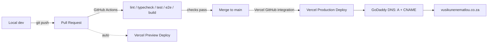

# Vusi Kunene Matlou — Portfolio

Personal developer portfolio, built from scratch and deployed to
[vusikunenematlou.co.za](https://vusikunenematlou.co.za). See
[`PRODUCT_BRIEF.md`](./PRODUCT_BRIEF.md) for the epic goal and
[`BACKLOG.md`](./BACKLOG.md) for the sprint plan and ticket status.

## Stack

Next.js (App Router) + TypeScript + Tailwind CSS, tested with Jest/React
Testing Library (unit) and Playwright (E2E), deployed on Vercel. Full
rationale in the project's sprint-0 discussion — see `DESIGN.md` for the
visual design tokens.

## Getting started

```bash
npm install
npm run dev       # http://localhost:3000
```

### Contact form

The contact section posts to `/api/contact`, which sends email via
[Resend](https://resend.com). Set these locally in `.env.local` (never commit
this file) and in the Vercel project's Environment Variables for production:

```bash
RESEND_API_KEY=      # required — from resend.com/api-keys
CONTACT_TO_EMAIL=     # optional, defaults to the email in src/data/resume.ts
CONTACT_FROM_EMAIL=   # optional, defaults to onboarding@resend.dev (Resend's
                       # sandbox sender — verify vusikunenematlou.co.za in
                       # Resend to send from a real address instead)
```

Without `RESEND_API_KEY` set, the form still validates input but returns a
503 instead of sending — it fails loudly rather than silently.

## Testing

```bash
npm run lint          # ESLint
npm run format:check  # Prettier check
npm run typecheck     # tsc --noEmit
npm test               # Jest + React Testing Library
npm run test:e2e       # Playwright, against a production build
```

All five checks run in CI (`.github/workflows/ci.yml`) on every pull request
into `main`; a PR cannot merge unless they pass.

## Deployment

- **Hosting:** Vercel, connected to this GitHub repo. Pushing to `main`
  deploys to production; every PR gets its own preview URL.
- **Domain:** `vusikunenematlou.co.za`, purchased via GoDaddy. DNS points at
  Vercel via an `A` record (apex) and `CNAME` (`www`), configured in the
  Vercel project's Domains settings.



## Repo structure

```
src/app/        Next.js App Router pages, layouts, and colocated unit tests
e2e/            Playwright end-to-end specs
.github/workflows/ci.yml   CI pipeline
BACKLOG.md      Sprint plan and ticket tracking (source of truth instead of Jira)
PRODUCT_BRIEF.md  One-page epic description
DESIGN.md       Design tokens (color, type, spacing)
```
